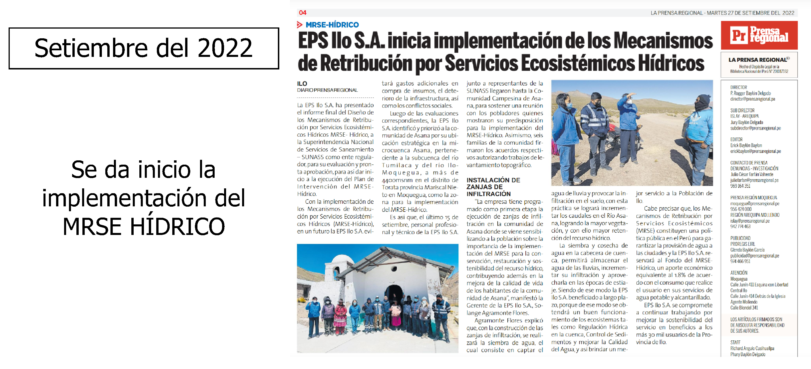

```{r setup, include=FALSE}
library(flexdashboard)
```

Pestaña1
===

Column {data-width=650}
-----------------------------------------------------------------------

### Chart A


Column {data-width=350}
-----------------------------------------------------------------------

### Chart B

```{r}

```

### Chart C

```{r}

```


Pestaña2 {.storyboard}
===

### Noticia 1


***
Esta es la primera sección de noticias


### Noticia 2



***
Esta es la primera sección de noticias Esta es la primera sección de noticiasEsta es la primera sección de noticiasEsta es la primera sección de noticiasEsta es la primera sección de noticiasEsta es la primera sección de noticiasEsta es la primera sección de noticiasEsta es la primera sección de noticiasEsta es la primera sección de noticias

Monitoreo
===

Column {data-width=250}
---

### Parte 1

Column {.tabset data-width=200}
---

### 2023

Aquí van los códigos de programación

### 2024

Aquí va más código

### 2025

Aquí va más código


Column {data-width=250}
---


